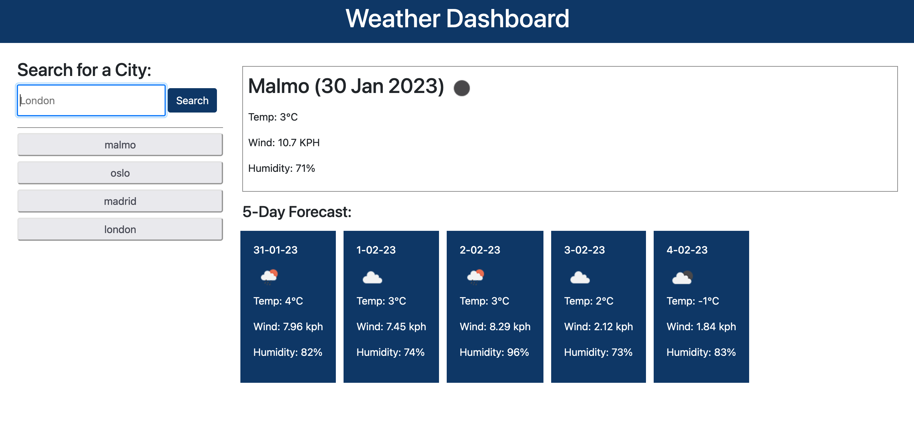

# Weather Dashboard App

## Description

I have created a weather dashboard app using the Open Weather API. The app will search for your chosen city and display the current weather, as well as a 5 day forecast. Your searched-for cities will be displayed upon refreshing the page, and you'll be able to search for the cities again by clicking the dynamically created buttons. 

This app has been created using HTML, Bootstrap, CSS, Javascript, JQuery and the Open Weather API. 

## Installation

You will need a valid api key from Open Weather to use this app successfully. 

## Usage
Live Deployed Page: https://reets93.github.io/weather-dashboard-app/

Please note that to use the weather app, you will need a valid api key from Open Weather. 

## License

MIT License. Please see license details in repository for more details. 